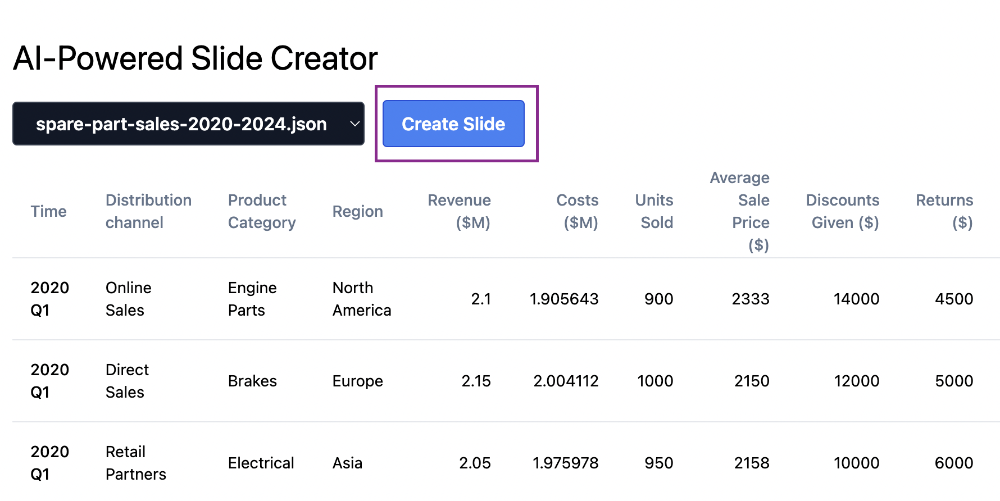
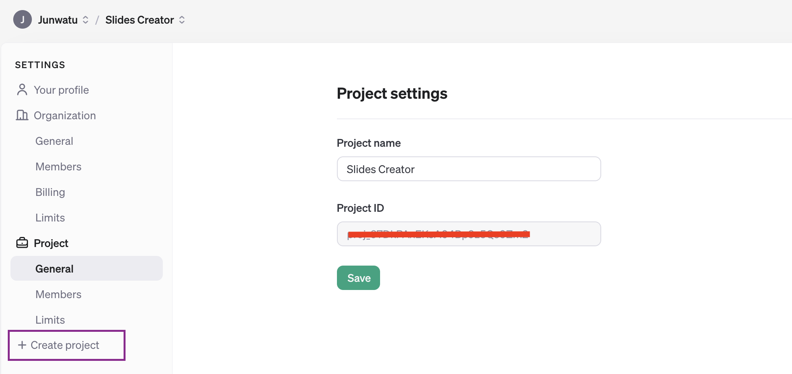
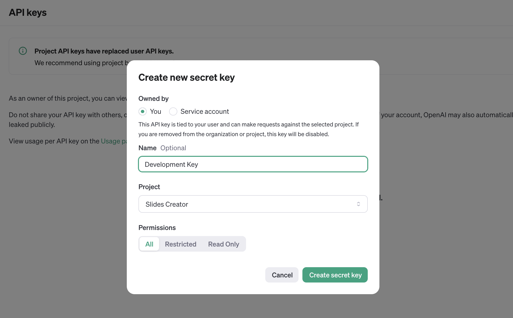
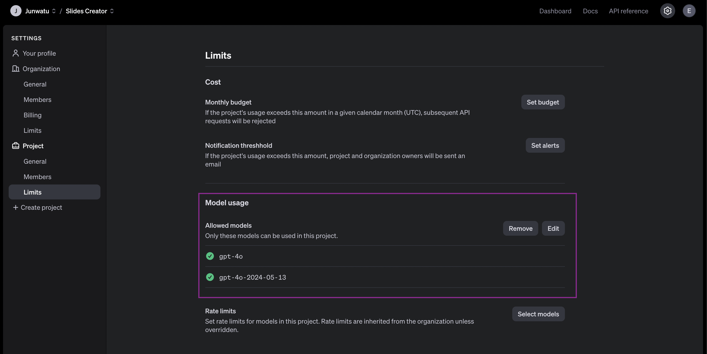
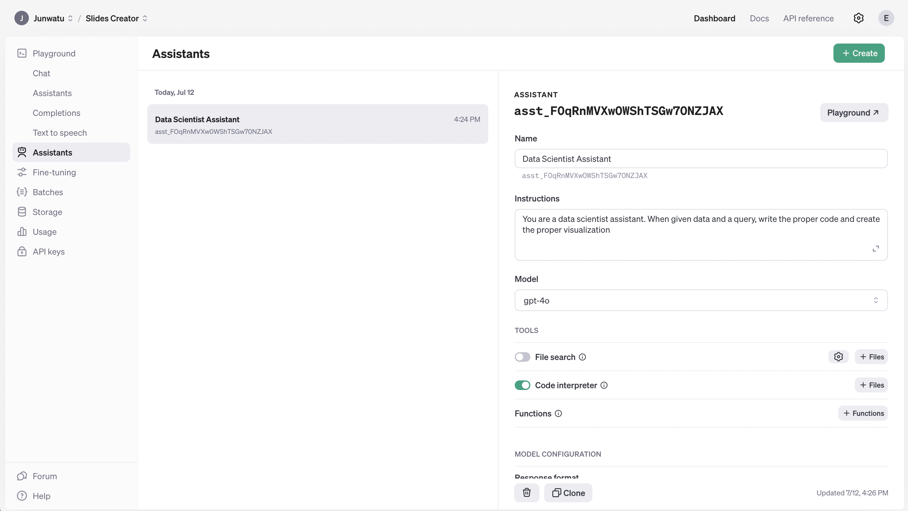
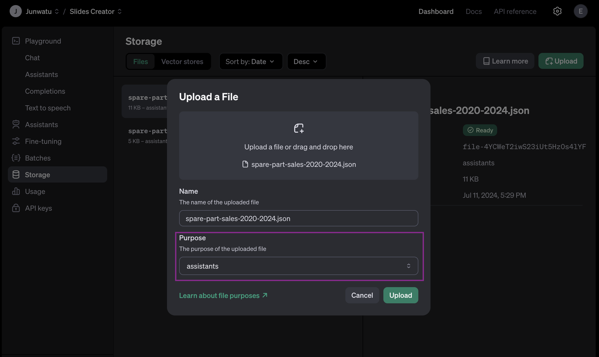
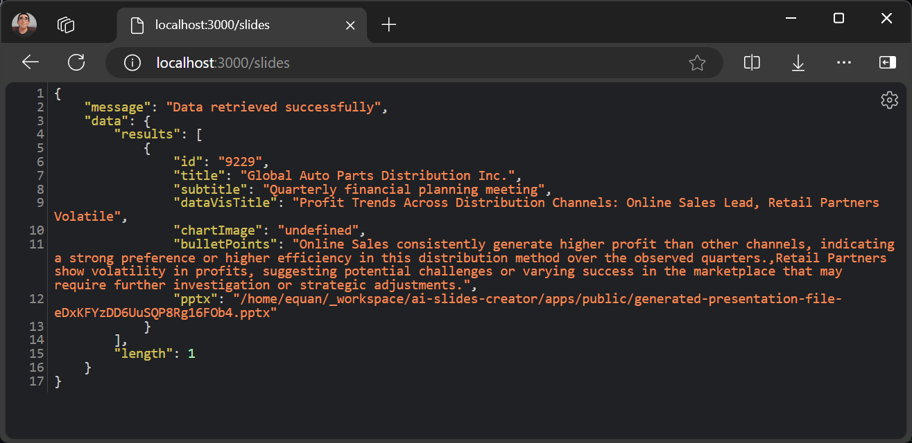
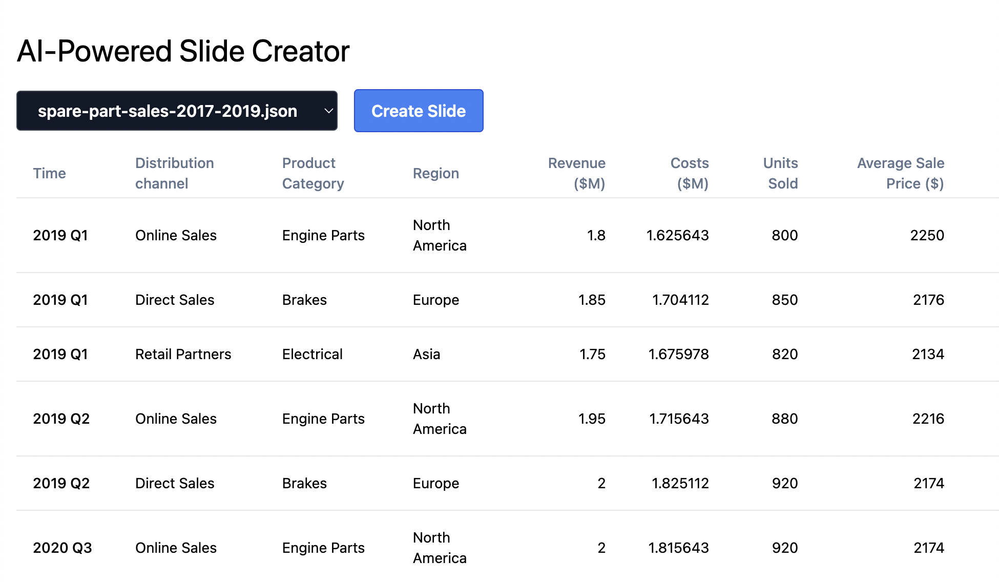

# Automate slide creation using OpenAI and Node.js


With the rise of AI tools, we can automate many manual workloads, including creating presentation slides. Developers can generate slide content programmatically by leveraging OpenAI's language models and Node.js. This automation surely will save time. By using OpenAI for content generation and Node.js for orchestration, you can effortlessly streamline the process of creating compelling and informative presentations.

In this post, we will use the Assistant API model from OpenAI to automate slide content creation, Node.js to create the slide document, and GridDB to save the slide information.

## Running the Project

Clone the source code from this [GitHub repository](https://github.com/junwatu/ai-slides-creator).

```shell
git clone https://github.com/junwatu/ai-slides-creator.git
```

You also need to install [Node.js](#1-installing-nodejs) and [GridDB](#2-setting-up-griddb) for this project to run. If the software requirements are installed, change the directory to the `apps` project directory and then install all the dependencies:

```shell
cd ai-slides-creator
cd apps
npm install 
```

Create a `.env` file and copy all environment variables from the `.env.example` file. You need an OpenAI key for this project, please look in [this section](#3-setup-openai-keys) on how to get the key.

```ini
OPENAI_API_KEY=sk-proj-secret
VITE_APP_URL=http://localhost:3000
```

You can change the `VITE_APP_URL` to your needs and then run the project by running this command:

```shell
npm run start:build
```

Then open the browser and go to the app URL. Select the data sample and then click the **Create Slide** button.



If the slide presentation is created successfully, a download link will be provided.

## Getting Started

### 1. Installing Node.js

This project will run on the Node.js platform. You need to install it from [here](https://nodejs.org/en/download). For this project, we will use the `nvm` package manager and Node.js v16.20.2
LTS version.

```shell
# installs nvm (Node Version Manager)
curl -o- https://raw.githubusercontent.com/nvm-sh/nvm/v0.39.7/install.sh | bash

# download and install Node.js
nvm install 16

# verifies the right Node.js version is in the environment
node -v # should print `v16.20.2`

# verifies the right NPM version is in the environment
npm -v # should print `8.19.4``
```

To connect Node.js and GridDB database, you need the [gridb-node-api](https://github.com/nodejs/node-addon-api) npm package which is a Node.js binding developed using GridDB C Client and Node addon API.

### 2. Setting Up GridDB

We will use the GridDB database to save recipes and it's nutrition analysis. Please look at the [guide](https://docs.griddb.net/latest/gettingstarted/using-apt/#install-with-apt-get) for detailed installation. We will use Ubuntu 20.04 LTS here.

Run GridDB and check if the service is running. Use this command:

```shell
sudo systemctl status gridstore
```

If not running try to run the database with this command:

```shell
sudo systemctl start gridstore
```

### 3. Setup OpenAI Keys

The OpenAI key is on a project basis, so we need to create a project first in the OpenAI platform.



To access any OpenAI services, you need a valid key. Go to this [link](https://platform.openai.com/api-keys) and create a new OpenAI key, make sure to select the right project.



You need also to enable any models that you use on a project. For this project, we will need the `gpt-4o` model. Go to the project settings and then select which models to be enabled.



You should save the OpenAI key on the `.env` file and make sure not to include it in version control by adding it to the `.gitignore`.

### 4. Setup AI Assistant

This project needs an AI assistant. You need to set it first, go to the project dashboard, and create a new assistant.



You need to pay attention to the **Instruction** field because it will dictate the behavior of the AI assistant. This is the instruction used for this assistant:

```text
You are a data scientist assistant. When given data and a query, write the proper code and create the proper visualization.
```

Another setup is you need to enable **Code Interpreter**, which means the assistant will be able to execute code in a sandbox environment, enabling your prompt to execute code. For more information on this feature, please click [here](https://platform.openai.com/docs/assistants/tools/code-interpreter).

After the AI assistant creation, you need to copy the assistant ID. This ID will be used as a reference in the code where you can send messages to the assistant.

```js
const dataScienceAssistantId = "asst_FOqRnMVXw0WShTSGw70NZJAX"
```

## Data Examples

This project will use JSON data samples from car spare parts sales. The data reside in the `data` directory. This is [the spare part sales data for the year 2020 to the year 2024](https://github.com/junwatu/ai-slides-creator/blob/main/apps/data/spare-part-sales-2020-2024.json):

```json
[
 {
  "Year": 2020,
  "Quarter": "Q1",
  "Distribution channel": "Online Sales",
  "Revenue ($M)": 2.10,
  "Costs ($M)": 1.905643,
  "Customer count": 190,
  "Time": "2020 Q1",
  "Product Category": "Engine Parts",
  "Region": "North America",
  "Units Sold": 900,
  "Average Sale Price ($)": 2333,
  "Discounts Given ($)": 14000,
  "Returns ($)": 4500,
  "Customer Satisfaction Rating": 8.2,
  "Salesperson": "SP120",
  "Marketing Spend ($)": 18000
 },
 {
  "Year": 2020,
  "Quarter": "Q1",
  "Distribution channel": "Direct Sales",
  "Revenue ($M)": 2.15,
  "Costs ($M)": 2.004112,
  "Customer count": 200,
  "Time": "2020 Q1",
  "Product Category": "Brakes",
  "Region": "Europe",
  "Units Sold": 1000,
  "Average Sale Price ($)": 2150,
  "Discounts Given ($)": 12000,
  "Returns ($)": 5000,
  "Customer Satisfaction Rating": 8.0,
  "Salesperson": "SP121",
  "Marketing Spend ($)": 19000
 },
 ...
 {
  "Year": 2024,
  "Quarter": "Q2",
  "Distribution channel": "Direct Sales",
  "Revenue ($M)": 3.15,
  "Costs ($M)": 2.525112,
  "Customer count": 390,
  "Time": "2024 Q2",
  "Product Category": "Brakes",
  "Region": "Europe",
  "Units Sold": 1500,
  "Average Sale Price ($)": 2095,
  "Discounts Given ($)": 22000,
  "Returns ($)": 17000,
  "Customer Satisfaction Rating": 9.1,
  "Salesperson": "SP144",
  "Marketing Spend ($)": 38000
 }
]
```

Ideally, the data should be uploaded via the user interface. However, for simplicity in this project, the data will be directly processed when you choose the data samples from the data samples dropdown.

**How can OpenAI process the file directly?**

The answer is, that you need to upload manually the data sample files first. Go to the project dashboard and upload the files.



You need to pay attention to the purpose of the uploaded files. In this project, the data sample files are used as **assistants** files.

Later these file IDs will be used to identify which file is used when the user selects the data sample from the dropdown.

## Generating Content

When the user selects the data sample and clicks the **Create Slide** button. The Assistant API will generate the image and text for the content slide. These are a few important steps in the code to generate the slide content:

### 1. Analyze Data Samples

OpenAI will analyze the selected data sample then it will calculate the profit by quarter and year then visualize the plot.

The prompt for this process is:

```js
const analyzeDataPrompt = "Calculate the profit (revenue minus cost) by quarter and year, and visualize as a line plot across the distribution channels, where the colors of the lines are green, light red, and light blue"
```

And this code will process the prompt and the selected file (see `fileId`)

```js
 const thread = await openai.beta.threads.create({
  messages: [
   {
    "role": "user",
    "content": analyzeDataPrompt,
    "attachments": [
     {
      file_id: fileId,
      tools: [{ type: "code_interpreter" }]
     }
    ]
   }
  ]
 });
```

From this code, you can get the plot image. It will be saved in the public directory and will be used in the slide content.

### 2. Generate Bullet Points

The AI Assistant will give an insight into the data and will generate bullet points. This is the prompt to instruct AI to give two insights about the data:

```js
const insightPrompt = `Give me two medium-length sentences (~20-30 words per sentence) of the most important insights from the plot you just created, and save each sentence as an item in one array. Give me a raw array, no formatting, no commentary. These will be used for a slide deck, and they should be about the 'so what' behind the data.`
```

### 3. Generate Insight Title

The last step is generating a title for the insight. This is the prompt that is responsible for that:

```js
const titlePrompt = "Given the plot and bullet point you created, come up with a very brief title only for a slide. It should reflect just the main insights you came up with."
```

The full code for generating slide content is in the [`libs/ai.js`](https://github.com/junwatu/ai-slides-creator/blob/main/apps/libs/ai.js) file.

## Generate Slides

This project uses the [PptxGenJS](https://gitbrent.github.io/PptxGenJS/) package to generate the slides. You can look at the full code in the `libs/pptx.js` file.

This is the code that calls the `createPresentation()` function when all the AI-generated slide information is ready.

```js
//...
if (bulletPointsSummary.status === "completed") {
					const message = await openai.beta.threads.messages.list(thread.id)
					const dataVisTitle = message.data[0].content[0].text.value

					presentationOptions = {
						title: slideTitle,
						subtitle: slideSubtitle,
						dataVisTitle: dataVisTitle,
						chartImagePath: path.join(__dirname, "public", `${filename}`),
						keyInsights: "Key Insights:",
						bulletPoints: bulletPoints,
						outputFilename: path.join(__dirname, 'public', pptxFilename)
					};

					try {
						createPresentation(presentationOptions)
					} catch (error) {
						console.log(error)
					}
}
//...
```

Just note that the generated presentation file will be saved in the `public` directory with each a unique name.

## Slides Information

To save the slide information, we will use the GridDB database. These are the database field's documentation:

| Field Name   | Type               | Description                                                                           |
|--------------|--------------------|---------------------------------------------------------------------------------------|
| id           | INTEGER            | A unique identifier for each record. This is the primary key for the container and must be unique for each entry. |
| title        | STRING             | The main title of the slide. It is a short descriptive title summarizing the content of the slide.                |
| subtitle     | STRING             | A secondary title or subheading providing additional context or a brief description related to the main title.     |
| chartImage   | STRING             | The URL or path to an image of a chart associated with the slide, used to link visual data representations.       |
| bulletPoints | STRING             | A string containing bullet points that summarize key information or highlights of the slide. Each bullet point is typically separated by a special character or newline. |
| pptx         | STRING             | The URL or path to the PowerPoint file (.pptx) that contains the slide, used to link the presentation file including the slide. |

The `griddbservices.js` and `libs/griddb.js` files are responsible for saving all the slide information to the database.

## Server Routes

The Node.js server provides a few routes for the client. This is the full documentation for the routes:

| Method | Route | Description |
|--------|-------|-------------|
| GET | `/` | Serves the `index.html` file from the 'dist' folder |
| GET | `/create/:fileId` | Triggers the AI assistant to process a file and create a presentation. Returns the save status and PPTX file name |
| GET | `/metadata` | Serves the `metadata.json` file from the `data` directory |
| GET | `/data/files` | Lists all JSON filenames in the `data` directory |
| GET | `/data/files/:filename` | Serves a specific JSON file from the `data` directory |
| GET | `/slides` | Retrieves all slides data from the database |

The most important route is `/create/:fileId` which triggers the AI assistant to analyze data samples, create a presentation, and then save all slide information to the database.

```js
app.get('/create/:fileId', async (req, res) => {
 const fileId = req.params.fileId

 try {
  const result = await aiAssistant(fileId)

  if (result.status === "completed") {
   const {
    title: titlePptx,
    subtitle: subtitlePptx,
    dataVisTitle: dataVisTitlePptx,
    chartImage: chartImagePptx,
    bulletPoints: bulletPointsPptx,
    outputFilename: pptxFile
   } = result.data

   const saveDataStatus = await saveData({ titlePptx, subtitlePptx, dataVisTitlePptx, chartImagePptx, bulletPointsPptx, pptxFile })

   res.json({
    save: saveDataStatus,
    data: result.data,
    pptx: result.pptx
   })
  } else {
   res.status(500).json({
    error: 'Task not completed', status: result.status
   })
  }

 } catch (error) {
  console.error('Error in AI Assistant:', error)
  res.status(500).json({ error: 'Error in AI Assistant', details: error.message })
 }
})
```

The `aiAssistant()` function will analyze the data sample, create a presentation return all information about the slide, and then save those slide information to the GridDB database using the `saveData()` function.

To get all the slide data just go to the `/slides` route and it will respond with all slide data saved in the database.



## User Interface



The main user interface consists of two components:

- **Data Dropdown**: To select a data sample.
- **Create Slide Button**: To trigge presentation creation.
- **Download Generated Presentation Link**: The download link for the presentation `.pptx` file.

## Further Enhancements

This is a prototype project with static data samples. Ideally, in production, you need to provide a better user interface to upload the data and customize the prompt.
